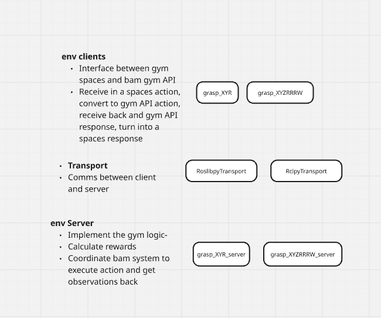

# Design Notes

Light weight package for bam gym environments

- Control remote gym environments running rosbridge_server using roslibpy
- Idea is that anyone can download this package and rapidly start developing with the familar gym api
- These environments can quickly tested on a ros free workspace, or also be wrapped by a ros server node 

## Acceptance Tests

- `test_local_gym.py` ✅
    - Verify you can play local gym envs locally

*require remote env to be running*

```ros2 launch bam_core_bringup gym_env.launch.py env:=CartPole```

- `test_roslibpy.py` ✅
    - Checks that a connection can be made to remote robot

- `test_remote_gym.py` ✅
    - Verify you can play cartpole remotely

- `test_random_agent.py -e GraspXYR` ❌
    - Verify that random actions work
    - See robot move in Foxglove
    - See robot observations in Local pygame

- `test_simple_v1_agent.py -e GraspXYR` ❌
    - Verify that simple heuristic agent works and rewards
    - See robot move in Foxglove
    - See robot observations in Local pygame

## Environments

- Before there was an idea to have a unique environment for each customer/application/etc. 
- Instead I now prefer to have a more general environment
- There are many, many things you would consider in a pick and place env...

- Before I wanted to send discrete variables, but now I want the interface to be richer

#### `PickAndPlace`

These enviornments parametrize a robot that does simple pick and place (robotics 2.0)

- The agent is a robot rack
- To control an entire row of robots, you can parralelize the env
- It picks up and item, and then it throws/places it at another location (Could be a machine, inside a bin, etc)
- This Env type can be used for many applications. No need to make a new Env for each application
- Should be easy to use for Agent. Default case is to just send pose you want it to grasp at. Do I want the ML engineer to think about where to drop of the items?
- Hmmm.. its a bit of added complexity, but I think its important. Otherwise core gets a bit to complicated.

- Parameterize motion with waypoints and params
###### Action Space:

- Grasps are represented by 7 DOF vector
    - Position (X, Y, Z)
    - Orientation (Rx, Ry, Rz)
    - Grasp Width

- Pick List - len (1-8):
    - 1 - 4 Target Grasps for 1-4 arms
    - Grasp Retries
    - Multiple arm grasps and grasp retries are handled in the same way (One Obs Out -> 1-8 Actions In -> 1-8 Rewards + 1 Obs)
    - The grasp approach, and where/how the item is placed is controled by the env/app config.

- Place Length (1 - 4)
 
- Other params
    - Throw, etc.
    - Expected obj class

- Can be extended to add more way points for controlling approach, etc. if desired (that would be a new environment though)


###### Observation Space:

- RGBD + Segmentation Image

###### Reward:

- 1 if grasp was succesful
- 0 otherwise

Speed of execution etc is control be robotics 2.0. Following Andy Leung and using a probability of success seems like a good approach.


###### Env Names

- `GraspXYR`
- `GraspXYRW`
- `GraspXYZRRRW`

###### Psuedo Code


---

Observation Space


This repository hosts the examples that are shown [on the environment creation documentation](https://gymnasium.farama.org/tutorials/gymnasium_basics/environment_creation/).

- `GridWorldEnv`: Simplistic implementation of gridworld environment

These are local gym libraries

local bam environments
- classic_bandit
- mnist

Transport bam environments
running on remote computers

## Installation

Tested on Ubuntu Noble

To install your new environment, run the following commands:

1. First download repo
- If Using ROS its reccomeded you do in different directory than bam_ws, as cd-autocomplete becomes a pain! Either in bam_ws/src/ or in other_bam_packages/

2. Install depencies

```
sudo apt update

sudo apt install python3-pip python3-venv

```

2. Install package into your virtual environment

- This assumes you already have a virtual environment for your development, please activate it.
- If you don't have one and want to standlone test, create a new virtual env

```{shell}
cd bam_gym
python3 -m venv --copies .venv
source .venv/bin/activate

```

Make sure your virtual env is active for the next steps 

Upgrade packages, then install

--

Determine your CUDA version and install correct torch. 
```
nvidia-smi

python3 -m pip install torch torchvision torchaudio --extra-index-url https://download.pytorch.org/whl/cu124

```

```{shell}
python3 -m pip install --upgrade pip setuptools wheel build hatchling
cd /bam_gym
python3 -m pip install -e .
```

```
python3 -m pip install gymnasium pygame

```

Check its installed correctly into your virtual env

```{shell}
python3 -m pip list
```

### Considerations for ROS development

Reccomended
- Install the package twice. Once inside ROS workspace (/bam_ws) and once in a ROS free standalone env (/other_bam_packages)
- Do all the development inside the standalone env, to make sure your not dependening on any ROS this
- Update and pull changes to the ROS workspace as needed

# Design Notes



"Reward is all you need" - [Sutton & Silver](https://www.sciencedirect.com/science/article/pii/S0004370221000862)

The goal of this package is to provide a light weight inerface for the BAM hardware.

The MDP interface really captures the essence of what we want to do here.

It's a super powerful abstraction, with a common set of language and open source tools (gym, rllib, etc.)


- It depends only on the same things needed to run gym envionrments (like cart_pole)
- gynamisum, pygame, numpy, etc.
- Install open cv and cv bridge for parsing images

Makes it very easy to do experiments on simple environments, and then switch to more complex ones by just changing a single line of code!

## Transport Layer

In BAM envs, generally the actual server is running remotely (simulation, real robot, etc)

By having a modular transport layer, you can implement any communication method (rclpy, roslibpy, custom tcp, etc.)

observation, reward, terminated, truncated, info = transport.step(action)


### roslibpy
https://roslibpy.readthedocs.io/en/latest/

Requires for rosbridge to be running on server computer

```ros2 launch rosbridge_server rosbridge_websocket_launch.xml```

- default port is 9090

#### Installing rosbridge

```sudo apt-get install ros-jazzy-rosbridge-suite```

https://wiki.ros.org/rosbridge_suite/Tutorials/RunningRosbridge

```ModuleNotFoundError: No module named 'bson'```

I belive caused by an issue of virtual env overriding system package. For now launching it outside of bam_ws works

Update: You cannot launch outside of bam_ws as then it won't have access to the bam_msgs package

```all_service InvalidModuleException: Unable to import bam_msgs.srv from package bam_msgs. Caused by: No module named 'bam_msgs'```

Install bson, which is a submodule of pymongo

``` python3 -m pip install pymongo ```

ros2 launch rosbridge_server rosbridge_websocket_launch.xml

#### Bugs


## How It can be used

1. Deployment

On a deployed BAM robot there is always live RL agent interacting with an indentical gym interface.

When you start controlling a real robot, you pause the deployed agent, and take over. 

If you are happy with your performance locally, you can freeze the weights and deploy to the real robot. 

As the deployed interface and api are indentical, you can simply copy paste. This makes CI a breeze.


2. Training

When locally training you can do online RL 

You can also run a script to collect a dataset and then do offline RL


3. Testing

Large scale training is done on a large remote GPU cluster, using an accumlated dataset that is stored on AWS. 
- Leveraging LLM infastructure for this

To verify the performance of the algorithim on completely new data, this interface can be used


3. Play/Experimentation

    Easy to poke around, and better understand the dynamics/action/observation spaces


# example agents

Folder is at top level so it imports it the same as an external


# Key Idea. 

First we made it look like an RL problem

Now we make it look like a supervised learning problem.

dataset.

We train for a bit, then we update the dataset with more samples. train for a bit, and reapeat!

# Saving Datasets.

- Idea 1
- Image as images in a folder, other data as a csv.

Using the replaybuffer lets you do alot of other things, in terms of having ordered data, etc.
Really this is a supervised leraning problem... How are supervised learning datasets saved? As images, actions and results... basically labels.
